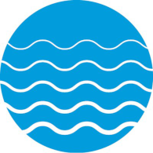

# Set up Backup and Restore for DigitalOcean Kubernetes

## Overview

Having a reliable system in place that performs regular backups of your DOKS cluster and associated resources is a very important piece of any setup. Imagine what would happen if one day you try to access one of your applications and suddenly it doesn't respond anymore, just as if it just vanished. Disk data corruption can drastically, and in a irreversible way destroy all your hard work in seconds and even less. But this is not the only reason, it can be due to many factors:

- Datacenter hardware failures (it can happen).
- External attacks from bad people who want to destroy your work (nothing is 100% secure).
- Human mistakes (from other people working in the same team, that have elevated permissions).

Main backup types are as follows, each with its own advantages and disadvantages:

- `Full` backups. You can restore at any time from any full backup.
- `Differential` backups. Requires an initial full backup. Then, on subsequent backup operations, it stores only the differences since the first full backup. To perform a restore, you need both the initial full backup and most recent differential backup.
- `Incremental` backups. Requires an initial full backup. Then, on subsequent backup operations, it stores only the differences from the previous backup. To perform a restore, you need the initial backup and each subsequent incremental backup.

Below table summarizes the pros and cons for each backup type:

|                             | Full                    | Differential                        | Incremental                             |
| --------------------------- |:-----------------------:|:-----------------------------------:|:---------------------------------------:|
| Storage Usage               | High                    | Medium to High                      | Low                                     |
| Backup Speed                | Slowest                 | Fast                                | Fastest                                 |
| Restoration Speed           | Fastest                 | Fast                                | Slowest                                 |
| Media Required for Recovery | Any backup              | Full backup and differential backup | Full backup and all incremental backups |
| Duplication                 | Lot of duplicate files  | Stores duplicate files              | No duplicate files                      |

A good `backup/restore` system for `DOKS` is one that allows you to:

- Perform a `full` DOKS cluster `backup` and restore it in a working state, at any time.
- Take `incremental backups` and benefit from `faster` backup/restore operations.
- Have `scheduled backups` in place, so that you can have `automated` backups and `revert` your system state quickly, if something goes wrong at any point in time.
- Set up `policies` for `backups retention` (in the end, disk space is finite).

`Starter Kit` comes to the rescue and presents you two of the most popular backup solutions, which should fulfill most of the required needs in this area. Both are Kubernetes native solutions. In the end, after studying each, you can decide which one suits best your needs.

Without further ado, please pick one to start with from the list below.

## Starter Kit Backup/Restore Solutions

| VELERO | TRILIO |
|:-----------------------------------------------------:|:-----------------------------------------------------:|
|  |  |
