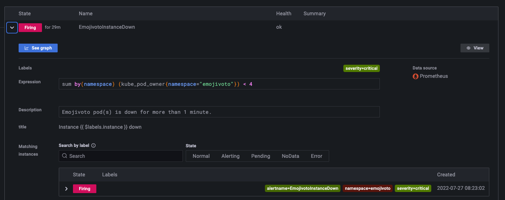
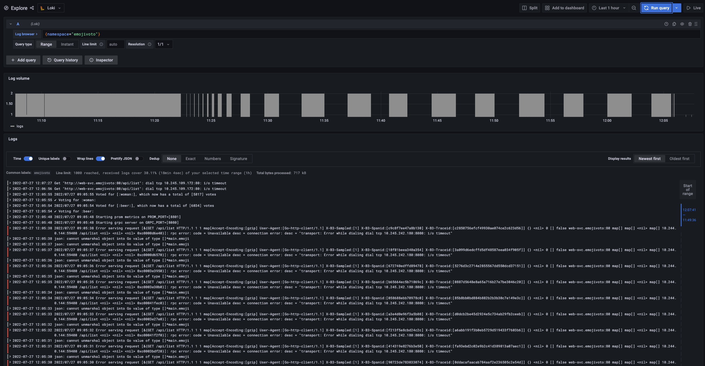

# Alerting and Notification

## Table of contents

- [Prerequisites](#prerequisites)
- [Alerting and Notification Overview](#alerting-and-notification-overview)
- [List of Included Alerts](#list-of-included-alerts)
- [Creating a New Alert](#creating-a-new-alert)
- [Configuring Alertmanager to Send Notifications to Slack](#configuring-alertmanager-to-send-notifications-to-slack)
- [Debugging a Firing Alert](#debugging-a-firing-alert)

## Prerequisites

To complete this tutorial, you will need:

1. Prometheus monitoring stack installed in your cluster as explained in [Chapter 4 - 04-setup-prometheus-stack](../04-setup-prometheus-stack/README.md) from the `Starter Kit`.
2. Loki stack installed in your cluster as explained in [Chapter 5- 05-setup-loki-stack](../05-setup-loki-stack/README.md) from the `Starter Kit`.
3. [Emojivoto Sample App](https://github.com/digitalocean/kubernetes-sample-apps/tree/master/emojivoto-example) deployed in the cluster. Please follow the [steps](https://github.com/digitalocean/kubernetes-sample-apps/tree/master/emojivoto-example#deploying-to-kubernetes) from the main repository. You will be creating alerts for this application.
4. Administrative rights over a `Slack` workspace. Later on you will be creating an application with an incoming `webhook` which will be used to send notifications from `Alertmanager`.

## Alerting and Notification Overview

Often times you need to be notified immediately about any critical issue in your cluster. That is where `Alertmanager` comes into the picture. `Alertmanager` helps in aggregating the `alerts`, and sending `notifications` as shown in the diagram below.


Usually, alertmanager is deployed alongside Prometheus and forms the alerting layer of the `kube-prom-stack`. It handles alerts generated by Prometheus by deduplicating, grouping, and routing them to various integrations such as email, Slack or PagerDuty.
Alerts and notifications are a critical part of your workflow. When things go wrong (e.g. any service is down, or a pod is crashing, etc.), you will want to get notifications in real time to handle critical situations as soon as possible.

Alertmanager is part of the `kube-prom-stack` installed in your cluster in [Chapter 4 - 04-setup-prometheus-stack](../04-setup-prometheus-stack/README.md). For this tutorial you will be using the same [manifest file](../04-setup-prometheus-stack/assets/manifests/prom-stack-values-v35.5.1.yaml) used in chapter 4 of the Starter Kit. `AlertManager` allows you to receive alerts from various clients (sources), like `Prometheus` for example. Rules are created on the `Prometheus` side, which in turn can fire alerts. Then, it’s the responsibility of `AlertManager` to intercept those alerts, group them (aggregation), apply other transformations and finally route to the configured receivers. Notification messages can be further formatted to include additional details if desired. You can use Slack, Gmail, etc to send real time notifications.

In this section, you will learn how to inspect the existing alerts, create new ones, and then configure `AlertManager` to send notifications via `Slack`.

## List of Included Alerts

Kube-prom-stack has over a hundred rules already activated.
To access the prometheus console, first do a port-forward to your local machine.

```shell
kubectl --namespace monitoring port-forward svc/kube-prom-stack-kube-prome-prometheus 9091:9090
```

Open a web browser on [localhost:9091](http://localhost:9091) and access the `Alerts` menu item. You should see some predefined `Alerts` and it should look like the following:


Click on any of the alerts to expand it. You can see information about expression it queries, the labels it has setup and annotations which is very important from a templating perspective. Prometheus supports templating in the annotations and labels of alerts. For more information check out the official [documentation](https://prometheus.io/docs/prometheus/latest/configuration/template_examples/).

## Creating a New Alert

To create a new alert, you need to add a new definition in the `additionalPrometheusRule`s section from the kube-prom-stack Helm values file.
You will be creating a sample alert that will trigger if the `emojivoto` namespace does not have an expected number of instances. The expected number of pods for the `emojivoto` application is 4.
First, open the `04-setup-prometheus-stack/assets/manifests/prom-stack-values.yaml` file provided in the `Starter Kit` repository, using a text editor of your choice (preferably with `YAML` lint support). Then, uncomment the `additionalPrometheusRules` block.

```yaml
additionalPrometheusRulesMap:
  rule-name:
    groups:
    - name: emojivoto-instance-down
      rules:
        - alert: EmojivotoInstanceDown
          expr: sum(kube_pod_owner{namespace="emojivoto"}) by (namespace) < 4
          for: 1m
          labels:
            severity: 'critical'
          annotations:
            description: ' The Number of pods from the namespace {{ $labels.namespace }} is lower than the expected 4. '
            summary: 'Pod {{ $labels.pod }} down'
```

Finally, apply settings using `Helm`:

  ```shell
  HELM_CHART_VERSION="35.5.1"

  helm upgrade kube-prom-stack prometheus-community/kube-prometheus-stack --version "${HELM_CHART_VERSION}" \
    --namespace monitoring \
    -f "04-setup-prometheus-stack/assets/manifests/prom-stack-values-v${HELM_CHART_VERSION}.yaml"
  ```

To check that the alert has been created successfully, navigate to the [Promethes Console][localhost:9091](http://localhost:9091) click on the `Alerts` menu item and identify the `EmojivotioInstanceDown` alert. It should be visible at the bottom of the list.

## Configuring Alertmanager to Send Notifications to Slack

To complete this section you need to have administrative rights over a workspace. This will enable you to create the incoming webhook you will need in the next steps. You will also need to create a channel where you would like to receive notifications from `AlertManager`.
You will be configuring `Alertmanager` to range over all of the alerts received printing their respective summaries and descriptions on new lines.

Steps to follow:

1. Open a web browser and navigate to `https://api.slack.com/apps` and click on the `Create New App` button.
2. In the `Create an app` window select the `From scratch` option. Then, give your application a name and select the appropriate workspace.
3. From the `Basic Information` page click on the `Incoming Webhooks` option, turn it on and click on the `Add New Webhook to Workspace` button at the bottom.
4. On the next page, use the `Search for a channel...` drop-down list to select the desired channel where you want to send notifications. When ready, click on the `Allow` button.
5. Take note of the `Webhook URL` value displayed on the page. You will be using it in the next section.

Next, you will tell `Alertmanager` how to send `Slack` notifications. Open the `04-setup-prometheus-stack/assets/manifests/prom-stack-values.yaml` file provided in the `Starter Kit repository`, using a text editor of your choice (preferably with YAML lint support). Then, uncomment the entire `alertmanager.config` block. Make sure to update the `slack_api_url` and `channel` values by replacing the <> placeholders accordingly:

```yaml
alertmanager:
  enabled: true
  config:
    global:
      resolve_timeout: 5m
      slack_api_url: "<YOUR_SLACK_APP_INCOMING_WEBHOOK_URL_HERE>"
    route:
      receiver: "slack-notifications"
      repeat_interval: 12h
      routes:
        - receiver: "slack-notifications"
          # matchers:
          #   - alertname="EmojivotoInstanceDown"
          # continue: false
    receivers:
      - name: "slack-notifications"
        slack_configs:
          - channel: "#<YOUR_SLACK_CHANNEL_NAME_HERE>"
            send_resolved: true
            title: "{{ range .Alerts }}{{ .Annotations.summary }}\n{{ end }}"
            text: "{{ range .Alerts }}{{ .Annotations.description }}\n{{ end }}"
```

Explanations for the above configuration:

- `slack_api_url` - incoming Slack webhook URL created in step 4.
- `receivers.[].slack_configs` - defines the Slack channel used to send notifications, notification title and the actual message. It is also possible to format the notification message (or body) based on your requirements.
- `title` and `text` - iterates over the firing alerts and prints out the summary and description using the `Prometheus` templating system.
- `send_resolved` - boolean indicating if `Alertmanager` should send a notification when an `Alert` is not firing anymore.

**Note:**

The `matcher` and `continue` parameters are still commented out as you will be uncomentting that later on in the guide. For now it should stay commented.

Finally, upgrade the `kube-prometheus-stack`, using `Helm`:

  ```shell
  HELM_CHART_VERSION="35.5.1"

  helm upgrade kube-prom-stack prometheus-community/kube-prometheus-stack --version "${HELM_CHART_VERSION}" \
    --namespace monitoring \
    -f "04-setup-prometheus-stack/assets/manifests/prom-stack-values-v${HELM_CHART_VERSION}.yaml"
  ```

At this point, you should receive slack `notifications` for all the firing alerts.

Next, you're going to test if the `EmojivotoInstanceDown` alert added previously works and sends a notification to `Slack` by downscaling the number of replicas for the `emoji` deployment from the `emojivoto` namespace.

Steps to follow:

1. From your terminal run the following command to bring the number of replicas for the `emoji` deployment to 0:

    ```shell
    kubectl scale --replicas=0 deployment/emoji -n emojivoto
    ```

2. Open a web browser on [localhost:9091](http://localhost:9091) and access the `Alerts` menu item. Search for the `EmojivotoInstanceDown` alert created earlier. The status of the alert should be `Firing` after about one minute of scaling down the deployment.
3. A message notification will be sent to `Slack` to the channel you configured earlier if everything went well. You should see the "The Number of pods from the namespace emojivoto is lower than the expected 4." alert in the `Slack` message as configure in the `annotations.description` config of the `additionalPrometheusRulesMap` block.

Currently all of the `Alerts` firing will be sent to the `Slack` channel. This can be cause for notification fatigue. To drill down on what is sent you can restrict `Alertmanager` to only send notification for alerts which match a certain pattern. This is done using the `matcher` parameter. Open the `04-setup-prometheus-stack/assets/manifests/prom-stack-values.yaml` file provided in the `Starter Kit repository`, using a text editor of your choice (preferably with YAML lint support). Then, uncomment the entire `alertmanager.config` block. Make sure to uncomment the `matcher` and the `continue` parameters:

```yaml
  config:
    global:
      resolve_timeout: 5m
      slack_api_url: "<YOUR_SLACK_APP_INCOMING_WEBHOOK_URL_HERE>"
    route:
      receiver: "slack-notifications"
      repeat_interval: 12h
      routes:
        - receiver: "slack-notifications"
          matchers:
            - alertname="EmojivotoInstanceDown"
          continue: false
    receivers:
      - name: "slack-notifications"
        slack_configs:
          - channel: "#<YOUR_SLACK_CHANNEL_NAME_HERE>"
            send_resolved: true
            title: "{{ range .Alerts }}{{ .Annotations.summary }}\n{{ end }}"
            text: "{{ range .Alerts }}{{ .Annotations.description }}\n{{ end }}"
```

Finally, upgrade the `kube-prometheus-stack`, using `Helm`:

  ```shell
  HELM_CHART_VERSION="35.5.1"

  helm upgrade kube-prom-stack prometheus-community/kube-prometheus-stack --version "${HELM_CHART_VERSION}" \
    --namespace monitoring \
    -f "04-setup-prometheus-stack/assets/manifests/prom-stack-values-v${HELM_CHART_VERSION}.yaml"
  ```

At this point you should only receieve alerts from the matching `EmojivotoInstanceDown` alertname. Since the `continue` is set to false `Alertmanager` will only send notifications from this alert and stop sending for others. 

**Notes:**
Clicking on the notification name in `Slack` will open a web browser to an unreachable web page with the internal Kubernetes DNS of the `Alertmanager` pod. This is expected. For more information you can check out this [article](https://kubernetes.io/docs/concepts/services-networking/dns-pod-service/).
For additional information about the configuration parameters for `Alertmanager` you can check out this [doc](https://prometheus.io/docs/alerting/latest/configuration/).
You can also at some notification examples in this [article](https://prometheus.io/docs/alerting/latest/notification_examples/).

## Debugging a Firing Alert

When an alert fires and sends a notification in Slack it's important that you can debug the problem easily and find the root cause in a timely manner.
To do this you can make use of `Grafana` which has already been installed in [Chapter 4 - 04-setup-prometheus-stack](../04-setup-prometheus-stack/README.md) and of `Loki` [Chapter 5- 05-setup-loki-stack](../05-setup-loki-stack/README.md).

Steps to follow:

1. Create a port forward for `Grafana` on port `3000`:

    ```shell
    kubectl --namespace monitoring port-forward svc/kube-prom-stack-grafana 3000:80
    ```

2. Open a web browser on [localhost:3000](http://localhost:3000) and log in using the default credentials (`admin/prom-operator`).
3. Navigate to the [Alerting](http://localhost:3000/alerting) section
4. From the `State` filter click on the `Firing` option, identify the `emojivoto-instance-down` alert defined in the [Creating a New Alert](#creating-a-new-alert) section and expand it. You should see the following:

5. Click on the `See graph` button. From the next page you can observe the count for the number of pods in the `emojivoto` namespace displayed as a metric. Take note that `Grafana` filters results using a time range of `Last 1 hour` by default. Adjust this to the time interval when the `Alert` fired. You can adjust the time range using an `absolute time range` using a `From To` option for a more granular result or using a `Quick range` such as `Last 30 minutes`.
6. From the `Explore` tab select the `Loki` data source and in the `Log browser` input the following: `{namespace="emojivoto"}` and click on the `Run query` button from the top right side of the page. You should see the following:
. Make sure you adjust the time interval accordingly.
7. From this page you can filter the log results further. For example to filter the logs for the `web-svc` container of the `emojivoto` namespace you can enter the following query: `{namespace="emojivoto", container="web-svc"}`. More explanations about using `LogQL` can be found in [Step 3 - Using LogQL](../05-setup-loki-stack/README.md#step-3---using-logql) from [Chapter 5 - 05-setup-loki-stack](../05-setup-loki-stack/README.md).

Go to [Section 08 - Encrypt Kubernetes Secrets Using Sealed Secrets](../08-kubernetes-sealed-secrets/README.md).
